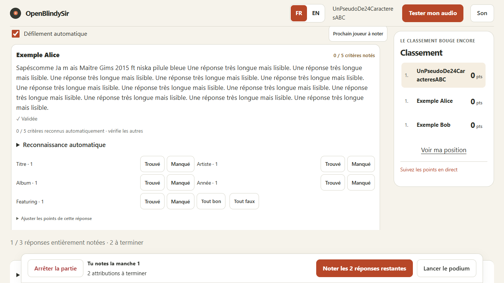

# Delivery following the October 8 recorded test

[Français and full V01–V17 matrix](2026-10-09-final-polish.md) · [Original analysis](2026-10-08-test-video.en.md)

The response-layout, preparation and finale-progression defects have been fixed
and checked. This is not a public-release certification: audible playback and
recovery on physical iPhone/Android devices still need validation. The source
recording has no usable audio.

## User-visible changes

- Names and answers retain useful width with five criteria and long automatic
  explanations. Criteria use two columns when their card has enough space.
- Scoring scroll handles oversized cards. Footer margins no longer move an
  already visible scoring button and disrupt the next-player transition.
- Automatic-reference checks follow unsaved criteria and filters. Missing
  references require explicit acknowledgement before starting, with counts and
  examples. Filenames alone are not trusted scoring references.
- Starting prepares host audio under the browser's gesture policy. Audio testing
  remains in the finale header; shared replay can reactivate audio after reload.
- Generated cartoon instructions are cleared when switching quick themes;
  personal instructions remain. Requested fields are explained near the single
  answer field, in French and English.
- Private scoring and public presentation have distinct round labels. Revisiting
  a round says “Present again” and never duplicates points. Navigation actions
  reach unfinished answers and standings.
- Partial scoring shows decided criteria. “Mark remaining criteria as missed”
  preserves existing decisions. The next unfinished answer takes priority over
  launching the podium.
- Published incomplete results retain the unfinished-answer count, including
  history and exports. Incomplete/all-zero results use a neutral presentation.
  New-game actions follow the ceremony before detailed standings.
- Live activity switches language correctly without replaying a scoring event.

## Evidence

- 1,200 Python tests passed; two Windows-specific exclusions (Unix permission
  bits and unavailable symlink privileges).
- 11 real server/Bridge integrations and 55 web unit tests passed.
- 117 Chromium UI scenarios passed after the last fixes; the full suite's five
  real-game scenarios also passed. An intermediate mobile scroll failure was
  fixed and rechecked rather than waived.
- TypeScript, Biome, Ruff, Pyright, generated protocol and repository hygiene
  checks passed. The existing roughly 520-kB uncompressed bundle warning remains.
- Computer Use: two isolated browser identities, two rounds, five criteria,
  incomplete references, partial awards, backwards presentation, replay after
  reload, reconnection, English player UI, matching 6–5 results and a new game.
  Desktop and 390 × 844 layouts were inspected. Tests used synthetic music/data.
- Candidate Linux app/Bridge images completed a synthetic AAC game with three
  simulated clients, read-only filesystems and non-root processes. Snapshot 10
  was written. Remote CI/WebKit are not included in these local results.

## Deployed installation

All components now use protocol **13**, snapshot **10** and history **3**. A
private stopped-state backup and previous image tags were preserved. Rolling
back requires restoring the compatible pre-upgrade state.

Post-restart checks found all services healthy and the Bridge online. The
installation retained 3 players, 14 archived games and 300 tracks, with identical
scores, responses, metadata, browser sessions, access information, mounts and
configuration. The LAN certificate is unchanged. Verified HTTPS serves exactly
the checked web build. No synthetic game ran in the real installation.

Application image:
`sha256:b15c0cc6a51dd6088ca4024914b9d6c35297e8957e691d2dfcb12abc5c6fcce7`.
Bridge image:
`sha256:f934419a9a768ad0cec8564d3a027272f82e5b5a1b18ac23b6c942d8d5ddf092`.

Before official release, verify actual iPhone/Safari and Android/Chrome sound,
sleep/background/network recovery, and a shared evening with several people.
Retain the existing multi-platform CI, installation and release-security gates.
This pass did not repeat the image CVE inventory or send an inventory to Docker
Scout; previous security reservations are not lifted by the protocol update.
