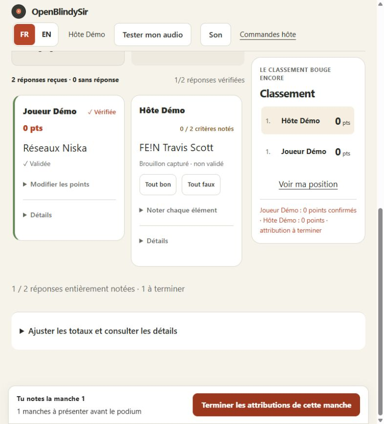
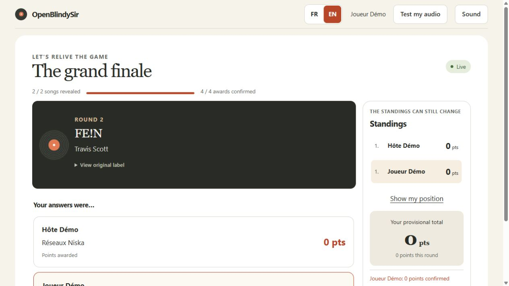

# Final simplifié et références depuis les noms de fichiers — 10 octobre 2026

## Résultat

Le panneau de notation met la réponse au centre. Une carte en attente offre
Trouvé/Manqué pour un critère, Tout bon/Tout faux pour plusieurs. Les décisions
partielles restent accessibles dans « Noter chaque élément ». Une carte vérifiée
montre son score et replie les commandes sous « Modifier les points ».
« Détails » contient les preuves automatiques, le temps et l’ajustement numérique.
Le défilement avancé apparaît seulement lorsque la liste déborde réellement.

La barre persistante offre une seule action selon l’étape. Les doublons, la
case de rythme et les commandes secondaires sortent du parcours principal.
« Options du final » conserve arrêt, rythme rapide et publication anticipée.
« Toutes les manches » regroupe recherche et sélection privée. Terminer une
manche rejoint d’abord sa propre réponse incomplète, sans changer de manche.
Réécouter ensemble et le classement partagé restent directement accessibles.

Sans référence musicale, le serveur extrait localement titre, artiste et featuring
d’un nom structuré tel que `Travis Scott - FE!N (feat. Playboi Carti).mp3`.
Les mentions de publication (Official/Lyrics/Clip Officiel), extensions et numéros
de piste sont nettoyés. Live/Remix et les tirets internes au titre sont conservés.
Un nom sans séparateur fournit seulement le titre ; aucun artiste n’est inventé.
Les identifiants génériques et UUID ne deviennent pas des références musicales.
Corrections explicites, imports et tags gardent priorité. Une suppression explicite
reste respectée. Album/année ne sont pas déduits. Les fichiers ne sont pas modifiés.
Préparation, sélection des morceaux prêts, notation automatique et révélation
utilisent ces références. Les manches déjà jouées restent figées ; une correction
avec « Enregistrer et renoter » est nécessaire pour les actualiser volontairement.

## Vérifications effectuées

- Python : 1 238 tests réussis, 2 ignorés, 11 tests d’intégration hors sélection.
- Frontend : 55 tests unitaires ; compilation TypeScript/Vite réussie ; Biome,
  Ruff et Pyright sans erreur ; contrat généré à jour (protocole 14).
- Navigateur Chrome : 127 tests d’interface et 5 scénarios avec serveur/Bridge réels
  réussis. Six nouveaux cas FR/EN à 390, 1 093 et 1 280 px contrôlent les deux
  choix, l’action principale unique et les détails repliés. Les deux parties
  complètes 1 280/320 px ont été rejouées avec succès après correction d’un test
  qui refermait par erreur un menu déjà ouvert (`open=""`).
- Computer Use : vraie pile isolée avec trois WAV synthétiques sans tags,
  deux navigateurs hôte FR/joueur EN, deux manches, attribution et publication
  jusqu’aux résultats. Les trois fichiers donnent titre/artiste à la préparation.
  Réponses verrouillées et brouillons capturés restent distincts. Les confirmations
  sont visibles en direct chez le joueur. Vue manuelle réelle : 786 × 884 px ;
  l’override de viewport de l’IAB n’a pas pris effet, les autres dimensions ont
  été vérifiées par les tests Chrome automatisés.
- Nouvelle image Linux : partie synthétique 2 manches/3 connexions, AAC,
  HTTPS/WSS avec validation du certificat, exécution non-root et lecture seule.
- Déploiement : sauvegarde privée des volumes arrêtés et images de retour arrière,
  puis redémarrage. Vérification de la session réelle : 4 joueurs, 16 archives,
  300 morceaux, résultats conservés. Scores, métadonnées, cookies, accès,
  configurations, montages et autorité TLS inchangés. Bundle servi identique au
  build local ; Bridge connecté.

Image app vérifiée :
`sha256:0508f3fd4f075e63cffb3c5acba59f9856afc9758a8afe5a282cafa665857d3c`.
Bridge et Caddy conservent leurs images de la précédente livraison.

## Captures de démonstration

## Limites

Un nom ambigu ne permet pas de garantir la bonne référence : l’hôte doit corriger
un ordre inversé ou un nom de fichier erroné. Les tests acoustiques et la suspension
sur téléphones physiques restent à vérifier. Aucun audit automatisé ne garantit
l’absence de bugs. Cette passe ne renouvelle pas l’audit CVE des images ; les
[constats de sécurité précédents](2026-10-10-conversation-check.md) restent applicables.
Ce candidat local ne constitue pas une annonce de version publique signée.
