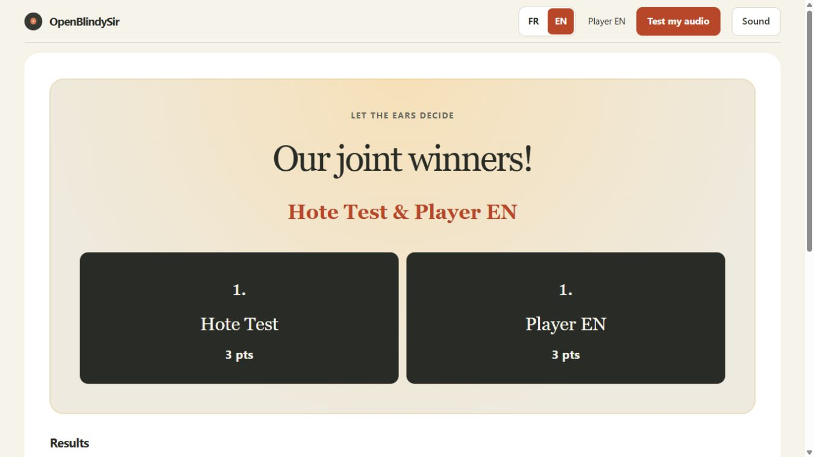
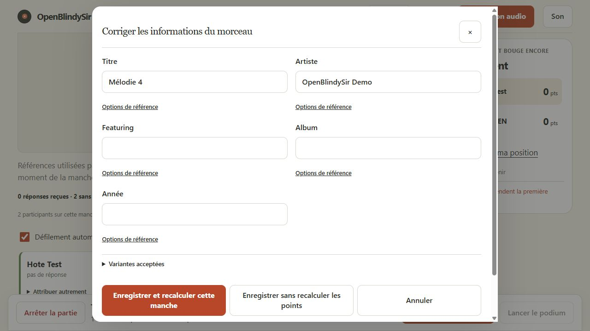

# Corrections du parcours filmé — 10 octobre 2026

[English](2026-10-10-video-fixes.en.md) · [Analyse initiale](2026-10-09-test-video-162745.md)

Cette livraison traite les quinze constats de la vidéo du 9 octobre. La validation
inclut une partie réelle à deux navigateurs pilotés par Computer Use, puis les
tests de régression et des images Docker avec audio synthétique. Elle ne constitue
pas une certification de fonctionnement acoustique sur tous les téléphones.

## Constats et corrections

| Constat | Changement livré et vérification |
| --- | --- |
| F01 — Références ambiguës | Distinction entre titre affiché et références de notation ; filtre des morceaux prêts pour les critères choisis. Démarrage incomplet contrôlé dans le navigateur. Les noms de fichiers ne deviennent pas des réponses officielles. |
| F02 — Tags incomplets | Lecture locale des cinq champs au scan, deux sondes simultanées et cinq secondes maximum par fichier. Cache taille/date, corrections explicites prioritaires. Tests de vrais MP3, MP4, FLAC tagués et d'un fichier sans tags. |
| F03 — Variante de titre rejetée | Similarité Indel normalisée : « validé »/« validée » donne 92,3 %, passe à 90 et échoue à 95. Noms de trois caractères ou moins et années restent exacts. Corpus de faux positifs conservé. |
| F04 — Brouillon reconnu sans points | Points proposés visibles et bouton d'acceptation explicite. Test réel d'une réponse non validée avec deux points proposés puis accordés. |
| F05 — Sauvegarde/recalcul cachés | Action principale « Enregistrer et recalculer cette manche », action distincte sans recalcul ; fermeture après confirmation serveur. Hatik reconnu et scores mis à jour dans les deux navigateurs. |
| F06 — Références absentes bloquantes | Exclusion collective explicite des critères sans référence, confirmation et restauration possibles. Contrôle serveur de révision ; ni exclusion d'une référence connue ni décision silencieuse. |
| F07 — Défilements concurrents | Deux cartes côte à côte sur bureau, sans ascenseur interne pour deux joueurs ; commandes avant diagnostics. Liste bornée pour les grands groupes. |
| F08 — Pause de défilement ambiguë | Libellé de pause explicite ; consulter les explications ne suspend plus l'avance. |
| F09 — Prochain joueur incorrect | Navigation relative à la carte active, boucle sur les réponses restantes ; le clic explicite amène la carte dans la page. |
| F10 — Éditeur difficile | Formulaire élargi, options avancées repliées, actions de sauvegarde fixes et cibles d'au moins 44 px. Fermeture uniquement après accusé serveur. |
| F11 — Bureau trop étroit | Largeur utile accrue, bandeau hôte compact, réponses et références plus lisibles. Contrôles bureau, petit écran et mobile. |
| F12 — Privé/public confondus | Sélecteur « Corriger une autre manche en privé », contexte public conservé. Retour 2 → 1 puis représentation vérifié sans double attribution. |
| F13 — Recalcul bloqué globalement | Verrouillage des décisions modifiées par critère ; les autres critères sont recalculés. Les totaux saisis manuellement et anciens verrouillages complets restent protégés. Test de correction du titre suivie de l'ajout de l'artiste. |
| F14 — Final consacré au diagnostic | Préparation en amont, propositions de points au premier plan, diagnostic repliable ; révélation collective et classement suivis côté joueur anglais pendant la correction française. |
| F15 — Podium incomplet | Récapitulatif actionnable par manche avant publication, avec réponses, brouillons et références restantes. Podium complet à égalité vérifié, puis retour au salon. |

## Vérification par Computer Use

Le blocage du pilote Windows a été contourné par le navigateur intégré pris en
charge, sans désactiver de contrôle de sécurité. Deux origines locales isolent les
cookies de l'hôte français et du joueur anglais. La partie de test est distincte
de la session LAN conservée.

Le parcours vérifié comprend connexion, préparation à cinq critères, avertissement
de références absentes, deux manches, réponse validée et brouillon, sauvegarde et
recalcul, acceptation de proposition, exclusion collective, représentation de la
manche précédente, podium complet, relance et reconnexion par cookie. Les scores
finaux sont de trois points chacun ; changer de manche ne les additionne pas.
Le téléphone est simulé à 390 × 844 ; ce n'est pas un test sur téléphone physique.

Le filtre des morceaux prêts a également été activé avec zéro référence complète :
le lancement reste bloqué. Après reconnexion pendant une nouvelle manche courte,
le geste audio réactive le téléchargement ; le bouton du final affiche ensuite
« Test signal started » côté joueur anglais.

Le bouton audio reste disponible durant le final. Le message de confirmation
signifie qu'un signal a été lancé, pas qu'un haut-parleur physique a été entendu.

## Compatibilité et limites

Protocole **14**, snapshot **11**, historique **3**, logiciel **0.5.0.dev0**.
Serveur, Bridge et interface doivent être mis à jour ensemble. Les anciens
snapshots sont migrés ; un retour arrière nécessite la sauvegarde compatible
effectuée avant mise à jour.

Les fichiers non tagués nécessitent toujours une référence confirmée par l'hôte ou
un import. Cette livraison ne recherche pas automatiquement les réponses sur
Internet et ne transforme pas le nom de fichier en référence fiable. Les tags
embarqués peuvent eux-mêmes être erronés : leur lecture ne certifie pas leur vérité.
La neutralisation conserve les totaux manuels ; l'hôte doit vérifier leur cohérence.

La validation sonore sur iOS/Android physiques, après verrouillage de l'écran et
changement de sortie Bluetooth, reste nécessaire avant d'annoncer une compatibilité
universelle. Les essais présents utilisent des sons synthétiques et ne publient
aucune vidéo privée ni secret de la session.

## Résultats de validation

- Python : **1 213 tests réussis**, deux ignorés pour limitations Windows, onze
  scénarios d'intégration exécutés séparément.
- Intégration : **11 réussis**, dont dix bots, redémarrage brutal, plusieurs Bridges,
  reconnexion, fichier supprimé après scan et upload corrompu.
- Web : **55 tests unitaires**, **117 tests UI** et **5 parcours de jeu réels** réussis
  avec Chrome installé. Les parties complètes durent environ une minute ; elles
  utilisent le délai prévu de trois minutes, sans raccourcir artificiellement la partie.
- Ruff, Pyright, Biome, TypeScript, génération du protocole et build réussis.
- Conteneurs Linux candidats : serveur et Bridge non-root, système en lecture seule,
  deux manches AAC synthétiques, trois clients simulés, résultats entièrement notés.
- Avertissement de build restant : bundle JavaScript supérieur à 500 ko minifié
  (environ 159 ko gzip). Il ne bloque pas la construction.

Les tests UI ont trouvé une cible secondaire de 28 px ; elle a été portée à 44 px.
Les anciens sélecteurs de tests ont été adaptés aux nouveaux libellés et au dialogue
qui se ferme après sauvegarde. Les contrôles ont été rejoués après correction.

## Déploiement vérifié

Sauvegarde privée des volumes arrêtés : `.local/backup-repair-20261010-014434`.
Anciennes images conservées sous le tag `before-repair-20261010`. Recréation du
serveur, du Bridge et du proxy ; serveur et proxy sains, Bridge connecté.
TLS vérifié avec l'autorité locale existante, sans désactiver la validation.
HTML, JavaScript et CSS servis identiques au build local testé.

Migration du snapshot 10 vers 11 confirmée. Les 4 joueurs, 15 archives, 300 morceaux,
scores, réponses, corrections, cookies, accès, configurations et montages sont
conservés. Les nouveaux tags du catalogue peuvent enrichir les références sans
écraser les corrections de l'hôte. La session reste en résultats finaux.

Images exécutées :

- `app`: `sha256:5d543519a83e0e5e6ad62b8759798c8c235ce62b60d7690158ff63312f3c4655`
- `bridge`: `sha256:7ad31ac1c79bd4e5fc3727a45d337dab8be8fc651d62d2d19bddbf862263a083`
- `caddy`: `sha256:b2877ff4fb23df45e83eb48e5dad0756b72b74468222f4cea6a1afc412506193`
